# 🛡️ Elastic SIEM Simulation

## _Advanced SIEM Project for Linux Threat Detection_

<div align="center">

   

_A comprehensive Security Information and Event Management (SIEM) laboratory designed for cybersecurity professionals, students, and detection engineers_

**🎯 Detect • 📊 Analyze • 🚨 Respond**

</div>

---

## 🎭 Project Overview

### 🔬 **What This Lab Demonstrates**

This project showcases how modern SIEM solutions like Elastic Security can detect, investigate, and respond to Linux-based cyber attacks in real-time. Built using the industry-standard ELK Stack, this lab provides hands-on experience with:

```mermaid
graph TD
    A[👤 Attacker] -->|Executes| B[🚨 Privilege Escalation]
    B --> C[📊 Auditbeat/Filebeat]
    C --> D[🔍 Logstash]
    D --> E[💾 Elasticsearch]
    E --> F[📈 Kibana Dashboard]
    F --> G[🛡️ SOC Analyst]
    G --> H[⚡ Threat Response]
```



### 🎯 **Core Learning Objectives**

|**Objective**|**Skills Developed**|**Real-World Application**|
|---|---|---|
|**SIEM Architecture**|Understanding ELK Stack components|Enterprise security monitoring|
|**Log Analysis**|Parse & correlate security events|Incident investigation|
|**Threat Detection**|Create detection rules & alerts|SOC operations|
|**Attack Simulation**|Generate realistic attack scenarios|Purple team exercises|

---

## 🏗️ **Technical Architecture**

### 🔧 **ELK Stack Components**

The ELK Stack (Elasticsearch, Logstash, Kibana) provides a complete log management solution for centralizing, processing, and visualizing security data:

```mermaid
flowchart LR
    subgraph "Data Sources"
        A[🖥️ Linux Victim VM]
        B[📝 System Logs]
        C[🔒 Audit Logs]
    end
    
    subgraph "Collection Layer"
        D[📊 Auditbeat]
        E[📄 Filebeat]
    end
    
    subgraph "ELK Stack"
        F[🔍 Logstash<br/>Processing]
        G[💾 Elasticsearch<br/>Storage]
        H[📈 Kibana<br/>Visualization]
    end
    
    subgraph "Detection & Response"
        I[🚨 Alerts]
        J[📊 Dashboards]
        K[🔍 Investigation]
    end
    
    A --> D
    B --> E
    C --> D
    D --> F
    E --> F
    F --> G
    G --> H
    H --> I
    H --> J
    H --> K
```



#### **Component Deep Dive:**

|Component|Purpose|Key Features|
|---|---|---|
|**🔍 Elasticsearch**|Distributed search & analytics engine|• Real-time indexing<br/>• Scalable storage<br/>• Full-text search|
|**📊 Logstash**|Data processing pipeline|• Log parsing<br/>• Data enrichment<br/>• Format normalization|
|**📈 Kibana**|Data visualization platform|• Interactive dashboards<br/>• Search interface<br/>• Alert management|
|**🎵 Beats**|Lightweight data shippers|• Auditbeat: System auditing<br/>• Filebeat: Log file monitoring|

---

## 🔍 **MITRE ATT&CK Framework Integration**

### 🎯 **Tactics & Techniques Covered**

This lab focuses on detecting Privilege Escalation (TA0004) techniques that adversaries use to gain higher-level permissions:


### 📊 **Detection Coverage Matrix**

|**MITRE Technique**|**Detection Method**|**Data Source**|**Confidence Level**|
|---|---|---|---|
|**T1068** - Exploitation for Privilege Escalation|Process execution monitoring|Auditbeat|🟢 High|
|**T1078** - Valid Accounts (Sudo abuse)|Authentication log analysis|Auditbeat|🟢 High|
|**T1098** - Account Manipulation|User account changes|System logs|🟡 Medium|

---

## 📂 **Project Structure**

```
Elastic-ReverseShell-Detection/
├── 🚀 attack-simulation/          # Attack scenario scripts
│   ├── invoke_attack.sh           # Main privilege escalation simulation
│   ├── payloads/                  # Attack payloads & techniques
│   └── README.md                  # Attack documentation
├── 📚 docs/                       # Comprehensive documentation
│   ├── setup_guide.md            # Detailed installation guide
│   ├── usage_guide.md            # Step-by-step usage instructions
│   └── theory/                   # Security theory & concepts
├── 🔧 elk-setup/                 # ELK Stack deployment
│   ├── docker-compose.yml        # Container orchestration
│   ├── configs/                  # Beat configurations
│   └── manual-setup/             # Traditional installation
├── 📊 kibana-rules/              # Detection rules & dashboards
│   ├── dashboards/               # Pre-built visualizations
│   ├── detection-rules/          # Custom detection logic
│   ├── screenshots/              # Visual documentation
│   └── exports/                  # Kibana saved objects
├── 📝 log-collection/            # Log storage & analysis
│   ├── simulation-logs/          # Captured attack logs
│   └── baseline-logs/            # Normal system behavior
└── README.md                     # Project overview (you are here)
```

---

## 🛠️ **Tools & Technologies**

### 🔧 **Core ELK Stack Components**

<table> <tr> <td align="center" width="25%">


**🔍 Elasticsearch** _Distributed Search & Analytics_

**Features:**

- Real-time indexing
- Full-text search
- Scalable storage
- RESTful API

**Role in Lab:** Stores and indexes all security events for fast search and analysis

</td> <td align="center" width="25%">


**⚙️ Logstash** _Data Processing Pipeline_

**Features:**

- Log parsing & enrichment
- Data transformation
- Format normalization
- Multi-input/output support

**Role in Lab:** Processes raw logs and enriches them before sending to Elasticsearch

</td> <td align="center" width="25%">


**📊 Kibana** _Data Visualization Platform_

**Features:**

- Interactive dashboards
- Real-time monitoring
- Alert management
- Search interface

**Role in Lab:** Provides security dashboards and alert visualization for threat detection

</td> <td align="center" width="25%">


**🛡️ Elastic Security** _SIEM & Security Analytics_

**Features:**

- MITRE ATT&CK mapping
- Detection rules
- Case management
- Threat hunting

**Role in Lab:** Provides advanced security features and detection capabilities

</td> </tr> </table>

---

### 📡 **Beats - Lightweight Data Shippers**

The Beats are lightweight data shippers, written in Go, that you install on your servers to capture all sorts of operational data and send it to the Elastic Stack.

<table> <tr> <td align="center" width="33%">


**📄 Filebeat** _Log File Shipper_

**What it does:** Collects and forwards log files from applications, services, and system logs

**Key Features:**

- ✅ Lightweight & efficient
- ✅ Multi-line log support
- ✅ Built-in modules for common apps
- ✅ Back-pressure resilience

**In This Lab:**

- Monitors system log files
- Collects application logs
- Handles syslog messages
- Processes authentication logs

**Configuration:**

```yaml
filebeat.inputs:
- type: log
  paths:
    - /var/log/auth.log
    - /var/log/syslog
```

</td> <td align="center" width="33%">


**🔍 Auditbeat** _Security Audit Data Shipper_

**What it does:** Collect and ship Linux audit framework data to the Elastic Stack, monitoring user activity and processes

**Key Features:**

- ✅ Linux audit framework integration
- ✅ File integrity monitoring
- ✅ Process execution tracking
- ✅ User activity monitoring

**In This Lab:**

- **Primary detection tool** for privilege escalation
- Monitors `sudo`/`su` commands
- Tracks process creation
- Detects file system changes

**Configuration:**

```yaml
auditbeat.modules:
- module: auditd
  audit_rules: |
    -w /usr/bin/sudo -p x -k sudo_exec
```

</td> <td align="center" width="33%">


**🪟 Winlogbeat** _Windows Event Log Shipper_

**What it does:** Specifically designed to collect Windows event logs

**Key Features:**

- ✅ Windows Event Log API integration
- ✅ Event filtering & enrichment
- ✅ Security event monitoring
- ✅ PowerShell logging support

**Future Enhancement:**

- Will be added in Phase 2
- Windows attack scenarios
- Multi-platform detection
- Cross-OS correlation

**Planned Configuration:**

```yaml
winlogbeat.event_logs:
- name: Security
- name: Microsoft-Windows-PowerShell/Operational
```

</td> </tr> </table>

---

### 🔬 **Tool Comparison Matrix**

|**Tool**|**Primary Function**|**Data Types**|**Performance**|**Use Case in Lab**|
|---|---|---|---|---|
|**Filebeat**|Log file shipping|Text logs, JSON|High throughput|System & application logs|
|**Auditbeat**|Security auditing|Audit events, file changes|Real-time|**Main detection engine**|
|**Winlogbeat**|Windows event logs|Windows events|Native integration|Future Windows support|
|**Metricbeat**|System metrics|Performance data|Low overhead|Planned: System monitoring|

---

### 🎯 **Why These Tools?**

#### **🚀 Performance Benefits**

- **Lightweight**: Beats are lightweight data shippers written in Go
- **Efficient**: Minimal resource consumption on monitored systems
- **Resilient**: Built-in retry mechanisms and back-pressure handling

#### **🔧 **Integration Advantages**

- **Native ELK Integration**: Filebeat works seamlessly with Logstash, Elasticsearch, and Kibana
- **Pre-built Modules**: Ready-to-use configurations for common applications
- **Flexible Output**: Can send directly to Elasticsearch or via Logstash

#### **🛡️ **Security Focus**

- **Audit Trail**: Auditd provides detailed audit trail of who did what and when
- **Real-time Detection**: Auditbeat sends events in realtime to Elasticsearch and communicates directly with the Linux audit framework
- **File Integrity**: Events contain file metadata and cryptographic hashes of file contents

---

### 📊 **Tool Architecture Visualization**

```mermaid
graph TB
    subgraph "🖥️ Linux Victim System"
        A[📄 Log Files<br/>/var/log/*]
        B[🔐 Audit Events<br/>Linux Kernel]
        C[📁 File System<br/>Changes]
    end
    
    subgraph "📡 Beats Layer"
        D[📄 Filebeat<br/>Log Shipper]
        E[🔍 Auditbeat<br/>Security Monitor]
    end
    
    subgraph "🔧 Processing Layer"
        F[⚙️ Logstash<br/>Data Pipeline]
    end
    
    subgraph "💾 Storage Layer"
        G[🔍 Elasticsearch<br/>Search Engine]
    end
    
    subgraph "📊 Visualization Layer"
        H[📊 Kibana<br/>Dashboard]
        I[🚨 Alerts<br/>Detection Rules]
    end
    
    A --> D
    B --> E
    C --> E
    D --> F
    E --> F
    F --> G
    G --> H
    G --> I
    
    style E fill:#ff9999,stroke:#ff0000,stroke-width:3px
    style I fill:#ffcccc,stroke:#ff0000,stroke-width:2px
```



---

## ⚡ **Quick Start Guide**

### 🚀 **Phase 1: Environment Setup**

<details> <summary><b>🐳 Option A: Docker Deployment (Recommended)</b></summary>

```bash
# Clone the repository
git clone https://github.com/your-username/Elastic-ReverseShell-Detection.git
cd Elastic-ReverseShell-Detection

# Deploy ELK Stack with Docker
cd elk-setup
docker-compose up -d

# Verify deployment
docker-compose ps
```

**✅ Expected Output:**

```
NAME                STATUS              PORTS
elasticsearch       running             9200/tcp, 9300/tcp
kibana             running             5601/tcp
logstash           running             5044/tcp
```

</details> <details> <summary><b>⚙️ Option B: Manual Installation</b></summary>

```bash
# Install Elasticsearch
wget https://artifacts.elastic.co/downloads/elasticsearch/elasticsearch-8.11.0-linux-x86_64.tar.gz
tar -xzf elasticsearch-8.11.0-linux-x86_64.tar.gz
cd elasticsearch-8.11.0/
./bin/elasticsearch

# Install Kibana
wget https://artifacts.elastic.co/downloads/kibana/kibana-8.11.0-linux-x86_64.tar.gz
tar -xzf kibana-8.11.0-linux-x86_64.tar.gz
cd kibana-8.11.0/
./bin/kibana

# Configure Beats (see docs/setup_guide.md for details)
```

</details>

### 🎯 **Phase 2: Attack Simulation**

```bash
# Execute privilege escalation attack
cd attack-simulation
chmod +x invoke_attack.sh
./invoke_attack.sh

# Monitor real-time detection
echo "🔍 Check Kibana dashboard at http://localhost:5601"
```

### 📊 **Phase 3: Detection Analysis**

1. **Access Kibana:** `http://localhost:5601`
2. **Navigate to:** `Analytics → Dashboard → Linux Threat Detection`
3. **Monitor panels:**
    - 🚨 **Real-time Alerts**
    - 📈 **Process Activity Timeline**
    - 🎯 **MITRE ATT&CK Mapping**
    - 👥 **User Behavior Analysis**

---

## 📈 **Dashboard Previews**

### 🖥️ **Main Detection Dashboard**

```
┌─────────────────────────────────────────────────────────────┐
│ 🛡️ Linux Threat Detection Dashboard                        │
├─────────────────────────────────────────────────────────────┤
│ 🚨 Active Alerts: 3        📊 Events/min: 127             │
│ 🎯 MITRE Techniques: 2     ⏱️ Last Update: 30s ago        │
├─────────────────────────────────────────────────────────────┤
│                                                             │
│  📈 Attack Timeline                                         │
│  ████████████████████████████████████████████████████      │
│                                                             │
│  👥 Top Suspicious Users    🔧 Top Processes               │
│  ┌─────────────────────┐   ┌─────────────────────┐         │
│  │ root        █████   │   │ sudo        █████   │         │
│  │ attacker    ███     │   │ su          ███     │         │
│  │ guest       █       │   │ bash        ██      │         │
│  └─────────────────────┘   └─────────────────────┘         │
└─────────────────────────────────────────────────────────────┘
```

---

## 🎓 **Learning Outcomes**

### 📚 **Technical Skills Developed**

<table> <tr> <td align="center" width="33%">

**🔍 SIEM Operations**

- Log ingestion & parsing
- Correlation rule creation
- Incident investigation
- Threat hunting techniques

</td> <td align="center" width="33%">

**🛡️ Security Analysis**

- Attack pattern recognition
- Behavioral analytics
- False positive reduction
- Risk assessment

</td> <td align="center" width="33%">

**🚀 Detection Engineering**

- Custom rule development
- Dashboard design
- Alert tuning
- Automation scripting

</td> </tr> </table>

### 🏆 **Certification Alignment**

|**Certification**|**Relevant Skills**|
|---|---|
|**GCIH**|Incident handling, log analysis|
|**GSEC**|Security fundamentals, monitoring|
|**GCFA**|Forensic analysis, timeline creation|
|**Security+**|SIEM concepts, threat detection|

---

## 🔮 **Advanced Features & Future Enhancements**

### 🚀 **Planned Improvements**

```mermaid
roadmap
    title Roadmap for Elastic SIEM Lab
    section Current Release
        Basic Privilege Escalation Detection    : done, des1, 2024-01-01, 2024-02-01
        Kibana Dashboard Integration           : done, des2, 2024-01-15, 2024-02-15
    section Phase 2
        Machine Learning Anomaly Detection     : active, des3, 2024-03-01, 2024-04-01
        Windows Environment Support           : des4, 2024-03-15, 2024-04-30
    section Phase 3
        Threat Intelligence Integration       : des5, 2024-05-01, 2024-06-01
        Automated Response Playbooks         : des6, 2024-05-15, 2024-06-30
    section Future
        Cloud Security Monitoring           : des7, 2024-07-01, 2024-08-01
        Container Security Detection        : des8, 2024-07-15, 2024-08-31
```

### 🎯 **Expansion Opportunities**

- **🤖 Machine Learning:** Implement Elastic's ML capabilities for anomaly detection
- **🌐 Multi-Platform:** Add Windows and macOS attack scenarios
- **☁️ Cloud Integration:** Include AWS/Azure security log analysis
- **🐳 Container Security:** Docker and Kubernetes threat detection
- **🔗 Threat Intelligence:** Integration with MISP and other TI feeds

---

## 📖 **Documentation**

### 📚 **Comprehensive Guides**

|Document|Purpose|Audience|
|---|---|---|
|**[Setup Guide](https://claude.ai/chat/docs/setup_guide.md)**|Complete installation instructions|System administrators|
|**[Usage Guide](https://claude.ai/chat/docs/usage_guide.md)**|Step-by-step lab execution|Security analysts|
|**[Theory Guide](https://claude.ai/chat/docs/theory/)**|Security concepts & background|Students & beginners|
|**[API Reference](https://claude.ai/chat/docs/api/)**|Elastic Stack configuration|Developers|

### 🎥 **Video Tutorials**

- 🎬 **Lab Setup Walkthrough** _(Coming Soon)_
- 🎬 **Attack Simulation Demo** _(Coming Soon)_
- 🎬 **Dashboard Creation Tutorial** _(Coming Soon)_

---

## 🌟 **Success Stories & Use Cases**

### 🎓 **Educational Impact**

> _"This lab provided hands-on experience that directly translated to my SOC analyst role. The MITRE ATT&CK integration was particularly valuable."_
> 
> **— Sarah M., Cybersecurity Student**

### 🏢 **Professional Development**

> _"Used this as a foundation for our enterprise SIEM deployment. The detection rules saved us months of development time."_
> 
> **— Mike R., Security Engineer**

---

## 🤝 **Contributing**

### 🔧 **How to Contribute**

<details> <summary><b>🚀 Development Setup</b></summary>

```bash
# Fork the repository
git clone https://github.com/your-username/Elastic-ReverseShell-Detection.git

# Create feature branch
git checkout -b feature/new-detection-rule

# Make your changes
# Test thoroughly

# Submit pull request
git push origin feature/new-detection-rule
```

</details>

### 📋 **Contribution Areas**

- 🎯 **New Attack Scenarios** - Add more MITRE ATT&CK techniques
- 📊 **Dashboard Improvements** - Enhance visualizations
- 🔍 **Detection Rules** - Create new correlation logic
- 📚 **Documentation** - Improve guides and tutorials
- 🐛 **Bug Fixes** - Resolve issues and improve stability

---

## 📞 **Support & Community**

<div align="center">

[](https://github.com/your-username/Elastic-ReverseShell-Detection/issues) [](https://github.com/your-username/Elastic-ReverseShell-Detection/discussions) [](https://github.com/your-username/Elastic-ReverseShell-Detection/wiki)

</div>

### 💬 **Get Help**

- 🐛 **Bug Reports:** Use GitHub Issues
- 💡 **Feature Requests:** Submit via Discussions
- 📚 **Documentation:** Check the Wiki
- 💬 **General Questions:** Community Discussions

---

## 👨‍💻 **Author**

<div align="center">

**Omkar Choudhury**  
_SIEM & Detection Engineering Enthusiast_

[](https://github.com/your-username) [](https://linkedin.com/in/your-profile) [](mailto:your-email@example.com)

</div>

### 🏆 **About the Author**

Passionate cybersecurity professional specializing in:

- 🛡️ **SIEM Engineering** - Enterprise security monitoring solutions
- 🔍 **Threat Detection** - Advanced analytics and correlation rules
- 📊 **Security Analytics** - Data-driven security insights
- 🎓 **Security Education** - Training and knowledge sharing

---

## 📄 **License**

This project is licensed under the **MIT License** - see the [LICENSE](https://claude.ai/chat/LICENSE) file for details.

### 🔓 **Open Source Philosophy**

```
MIT License - Free to use, modify, and distribute
✅ Commercial use allowed
✅ Modification allowed  
✅ Distribution allowed
✅ Private use allowed
❗ No warranty provided
❗ Author not liable
```

---

<div align="center">

**🌟 Star this repository if it helped you master SIEM technology! 🌟**

_Made with ❤️ for the cybersecurity community_

[](https://github.com/your-username/Elastic-ReverseShell-Detection/stargazers) [](https://github.com/your-username/Elastic-ReverseShell-Detection/network/members) [](https://github.com/your-username/Elastic-ReverseShell-Detection/watchers)

</div>