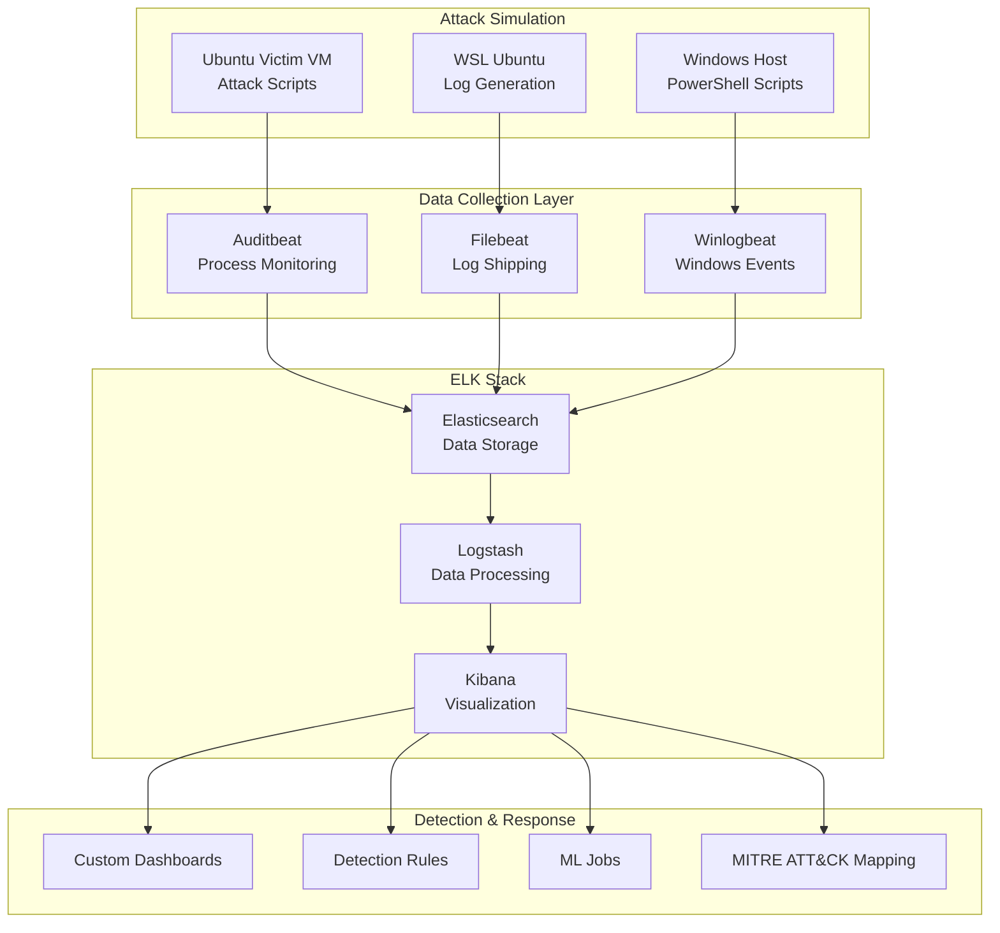

# ⚙️ Complete Elastic Detection Lab Setup Guide

<div align="center">

   

**🔥 From Zero to Hero: Complete Detection Engineering Lab**  
_Build a production-grade SIEM lab for attack simulation and detection testing_

</div>

---

## 📑 Table of Contents

- [[#🎯 Lab Architecture Overview]]
- [[#🔧 Prerequisites & System Requirements]]
- [[#🚀 Quick Start (Docker Method)]]
- [[#⚙️ Advanced Setup (Manual Installation)]]
- [[#📊 Log Collection Configuration]]
- [[#🛡️ Detection Rules & Dashboards]]
- [[#🔥 Attack Simulation Setup]]
- [[#✅ Verification & Testing]]
- [[#🛠️ Troubleshooting]]
- [[#📈 Performance Optimization]]

---

## 🎯 Lab Architecture Overview

<div align="center">



</div>

### 🏗️ **What You're Building**

|Component|Purpose|Detection Capability|
|---|---|---|
|**Ubuntu Victim VM**|Target for attack simulations|Privilege escalation, process injection|
|**ELK Stack**|Central logging and analysis|Real-time threat detection|
|**Detection Rules**|Automated threat hunting|MITRE ATT&CK techniques|
|**Custom Dashboards**|Visual threat monitoring|SOC-ready visualizations|

---

## 🔧 Prerequisites & System Requirements

### 💻 **Hardware Requirements**

<table> <tr> <th>Component</th> <th>Minimum</th> <th>Recommended</th> <th>Purpose</th> </tr> <tr> <td><strong>RAM</strong></td> <td>8 GB</td> <td>16 GB+</td> <td>ELK Stack + VMs</td> </tr> <tr> <td><strong>CPU</strong></td> <td>4 cores</td> <td>8 cores</td> <td>Data processing</td> </tr> <tr> <td><strong>Storage</strong></td> <td>50 GB</td> <td>200 GB+</td> <td>Log storage</td> </tr> <tr> <td><strong>Network</strong></td> <td>Internal</td> <td>Isolated VLAN</td> <td>Containment</td> </tr> </table>

### 🖥️ **Software Prerequisites**

**Base System Requirements:**

```bash
# Ubuntu/Debian
sudo apt update && sudo apt install -y \
    curl wget git vim \
    docker.io docker-compose \
    python3 python3-pip \
    net-tools htop
```

**Windows Requirements:**

- PowerShell 5.1+
- Administrator privileges
- Windows Defender disabled (for testing)

### 🌐 **Network Configuration**

**Required Ports:**

- **9200**: Elasticsearch API
- **5601**: Kibana Dashboard
- **5044**: Logstash Beats Input
- **22**: SSH (for remote management)

```bash
# Configure firewall
sudo ufw allow 9200/tcp
sudo ufw allow 5601/tcp
sudo ufw allow 5044/tcp
sudo ufw enable
```

---

## 🚀 Quick Start (Docker Method)

> **⚡ Fastest way to get started** - Production-ready in 15 minutes

### 📥 **Step 1: Clone Repository**

```bash
# Clone the detection lab repository
git clone https://github.com/your-username/Elastic-Detection-Lab.git
cd Elastic-Detection-Lab
```

### 🐳 **Step 2: Docker Setup**

```bash
# Navigate to ELK setup directory
cd elk-setup

# Review configuration files
ls -la
# Expected files: docker-compose.yml, elasticsearch.yml, kibana.yml
```

### 🚀 **Step 3: Launch ELK Stack**

```bash
# Start ELK services in detached mode
docker-compose up -d

# Verify all services are running
docker-compose ps
```

**Expected Output:**

```bash
      Name                    Command               State           Ports
---------------------------------------------------------------------------
elasticsearch    /bin/tini -- /usr/local/bi ...   Up      0.0.0.0:9200->9200/tcp
kibana          /bin/tini -- /usr/local/bi ...   Up      0.0.0.0:5601->5601/tcp
logstash        /usr/local/bin/docker-entr ...   Up      0.0.0.0:5044->5044/tcp
```

### 🔑 **Step 4: Obtain Credentials**

```bash
# Get Elasticsearch password
docker-compose logs elasticsearch 2>&1 | grep "generated password"

# Alternative: Reset password
docker exec -it elasticsearch_container elasticsearch-reset-password -u elastic
```

### 🌐 **Step 5: Access Kibana**

1. **Open browser:** `http://localhost:5601`
2. **Login credentials:**
    - Username: `elastic`
    - Password: `[from previous step]`

---

## ⚙️ Advanced Setup (Manual Installation)

> **🔧 For production environments** - Complete control and customization

### 🔍 **Step 1: Elasticsearch Installation**

#### **Repository Setup**

```bash
# Import Elastic GPG key
curl -fsSL https://artifacts.elastic.co/GPG-KEY-elasticsearch | sudo apt-key add -

# Add Elastic repository
echo "deb https://artifacts.elastic.co/packages/8.x/apt stable main" | sudo tee /etc/apt/sources.list.d/elastic-8.x.list

# Update package database
sudo apt update
```

#### **Installation & Configuration**

```bash
# Install Elasticsearch
sudo apt install elasticsearch -y

# Configure memory settings
sudo nano /etc/elasticsearch/jvm.options
```

**JVM Configuration:**

```bash
# Adjust based on available RAM (50% of system memory)
-Xms2g
-Xmx2g
```

#### **Network Configuration**

```bash
# Edit main configuration
sudo nano /etc/elasticsearch/elasticsearch.yml
```

**Key Settings:**

```yaml
# Network configuration
network.host: 0.0.0.0
http.port: 9200

# Security settings
xpack.security.enabled: true
xpack.security.transport.ssl.enabled: true

# Cluster configuration
cluster.name: detection-lab
node.name: elastic-node-1
```

#### **Service Management**

```bash
# Enable and start Elasticsearch
sudo systemctl enable elasticsearch
sudo systemctl start elasticsearch

# Verify service status
sudo systemctl status elasticsearch

# Test connectivity
curl -k -u elastic https://localhost:9200
```

### 📊 **Step 2: Kibana Installation**

```bash
# Install Kibana
sudo apt install kibana -y

# Configure Kibana
sudo nano /etc/kibana/kibana.yml
```

**Kibana Configuration:**

```yaml
# Server configuration
server.host: "0.0.0.0"
server.port: 5601

# Elasticsearch connection
elasticsearch.hosts: ["https://localhost:9200"]
elasticsearch.username: "kibana_system"
elasticsearch.password: "your-kibana-password"

# SSL configuration (for development)
elasticsearch.ssl.verificationMode: none

# Security keys (generate with: openssl rand -hex 32)
xpack.encryptedSavedObjects.encryptionKey: "your-32-char-encryption-key"
xpack.reporting.encryptionKey: "your-32-char-reporting-key"
xpack.security.encryptionKey: "your-32-char-security-key"

# Logging configuration
logging:
  appenders:
    file:
      type: file
      fileName: /var/log/kibana/kibana.log
      layout:
        type: json
  root:
    appenders: [default, file]
```

#### **Create Required Directories**

```bash
# Create log directory
sudo mkdir -p /var/log/kibana
sudo chown kibana:kibana /var/log/kibana

# Create PID directory
sudo mkdir -p /run/kibana
sudo chown kibana:kibana /run/kibana
```

#### **Start Kibana Service**

```bash
# Enable and start Kibana
sudo systemctl enable kibana
sudo systemctl start kibana

# Check service status
sudo systemctl status kibana

# Monitor logs
sudo tail -f /var/log/kibana/kibana.log
```

### 📡 **Step 3: Logstash Installation (Optional)**

```bash
# Install Logstash
sudo apt install logstash -y

# Create configuration file
sudo nano /etc/logstash/conf.d/beats-input.conf
```

**Logstash Configuration:**

```ruby
input {
  beats {
    port => 5044
  }
}

filter {
  if [fields][logtype] == "audit" {
    grok {
      match => { "message" => "%{GREEDYDATA:audit_message}" }
    }
  }
}

output {
  elasticsearch {
    hosts => ["localhost:9200"]
    user => "elastic"
    password => "your-password"
    ssl => true
    ssl_certificate_verification => false
  }
}
```

```bash
# Start Logstash
sudo systemctl enable logstash
sudo systemctl start logstash
```

---

## 📊 Log Collection Configuration

### 🐧 **Ubuntu Victim VM Setup**

#### **Auditbeat Installation**

```bash
# Download and install Auditbeat
curl -L -O https://artifacts.elastic.co/downloads/beats/auditbeat/auditbeat-8.8.0-amd64.deb
sudo dpkg -i auditbeat-8.8.0-amd64.deb
```

#### **Auditbeat Configuration**

```bash
# Backup original configuration
sudo cp /etc/auditbeat/auditbeat.yml /etc/auditbeat/auditbeat.yml.backup

# Create new configuration
sudo nano /etc/auditbeat/auditbeat.yml
```

**Auditbeat Configuration:**

```yaml
# Auditbeat configuration for attack detection
auditbeat.config.modules:
  path: ${path.config}/modules.d/*.yml
  reload.enabled: false

auditbeat.modules:
- module: auditd
  audit_rule_files: [ '${path.config}/audit.rules.d/*.conf' ]
  audit_rules: |
    # Privilege escalation detection
    -a always,exit -F arch=b64 -S execve -F path=/bin/su -F key=privilege_escalation
    -a always,exit -F arch=b64 -S execve -F path=/usr/bin/sudo -F key=privilege_escalation
    -a always,exit -F arch=b64 -S execve -F path=/bin/bash -F key=shell_execution
    
    # File access monitoring
    -w /etc/passwd -p wa -k passwd_changes
    -w /etc/shadow -p wa -k shadow_changes
    -w /etc/sudoers -p wa -k sudoers_changes

- module: file_integrity
  paths:
  - /bin
  - /usr/bin
  - /etc
  
- module: system
  datasets:
    - process
    - socket
  process.hash.hash_types: [md5, sha1, sha256]

# Output configuration
output.elasticsearch:
  hosts: ["https://your-elk-server:9200"]
  username: "elastic"
  password: "your-password"
  ssl.verification_mode: none

# Kibana setup
setup.kibana:
  host: "https://your-elk-server:5601"
  username: "elastic"
  password: "your-password"
  ssl.verification_mode: none

# Logging
logging.level: info
logging.to_files: true
logging.files:
  path: /var/log/auditbeat
  name: auditbeat
  keepfiles: 7
  permissions: 0644
```

#### **Custom Audit Rules**

```bash
# Create audit rules directory
sudo mkdir -p /etc/auditbeat/audit.rules.d

# Create privilege escalation rules
sudo nano /etc/auditbeat/audit.rules.d/privilege-escalation.conf
```

**Audit Rules:**

```bash
# Privilege escalation monitoring
-a always,exit -F arch=b64 -S execve -F path=/bin/su -F key=priv_esc
-a always,exit -F arch=b64 -S execve -F path=/usr/bin/sudo -F key=priv_esc
-a always,exit -F arch=b64 -S setuid -F key=setuid_abuse

# SUID binary execution
-a always,exit -F arch=b64 -S execve -F perm=u+s -F key=suid_exec

# Suspicious commands
-a always,exit -F arch=b64 -S execve -F exe=/usr/bin/find -F key=recon
-a always,exit -F arch=b64 -S execve -F exe=/bin/ps -F key=recon
-a always,exit -F arch=b64 -S execve -F exe=/bin/netstat -F key=recon
```

#### **Start Auditbeat**

```bash
# Test configuration
sudo auditbeat test config
sudo auditbeat test output

# Start service
sudo systemctl enable auditbeat
sudo systemctl start auditbeat

# Verify status
sudo systemctl status auditbeat
```

### 📄 **WSL Ubuntu - Filebeat Setup**

```bash
# Install Filebeat
curl -L -O https://artifacts.elastic.co/downloads/beats/filebeat/filebeat-8.8.0-amd64.deb
sudo dpkg -i filebeat-8.8.0-amd64.deb

# Configure Filebeat
sudo nano /etc/filebeat/filebeat.yml
```

**Filebeat Configuration:**

```yaml
filebeat.inputs:
- type: log
  enabled: true
  paths:
    - /var/log/*.log
    - /var/log/auth.log
    - /var/log/syslog
  fields:
    logtype: syslog
  fields_under_root: true

- type: log
  enabled: true
  paths:
    - /home/*/.bash_history
  fields:
    logtype: bash_history
  fields_under_root: true

output.elasticsearch:
  hosts: ["https://your-elk-server:9200"]
  username: "elastic"
  password: "your-password"
  ssl.verification_mode: none

setup.kibana:
  host: "https://your-elk-server:5601"
```

### 🪟 **Windows - Winlogbeat Setup**

#### **Installation**

```powershell
# Download Winlogbeat
Invoke-WebRequest -Uri "https://artifacts.elastic.co/downloads/beats/winlogbeat/winlogbeat-8.8.0-windows-x86_64.zip" -OutFile "winlogbeat.zip"

# Extract to Program Files
Expand-Archive winlogbeat.zip "C:\Program Files\Winlogbeat"
cd "C:\Program Files\Winlogbeat"
```

#### **Configuration**

```powershell
# Edit configuration file
notepad winlogbeat.yml
```

**Winlogbeat Configuration:**

```yaml
winlogbeat.event_logs:
  - name: Application
    ignore_older: 72h
  - name: System
  - name: Security
    processors:
      - script:
          lang: javascript
          id: security
          source: >
            function process(event) {
                return event;
            }
  - name: Microsoft-Windows-Sysmon/Operational
  - name: Microsoft-Windows-PowerShell/Operational
    event_id: 4103, 4104

output.elasticsearch:
  hosts: ["https://your-elk-server:9200"]
  username: "elastic" 
  password: "your-password"
  ssl.verification_mode: none

setup.kibana:
  host: "https://your-elk-server:5601"
```

#### **Service Installation**

```powershell
# Install as Windows service
.\winlogbeat.exe install

# Start service
Start-Service winlogbeat

# Verify service
Get-Service winlogbeat
```

---

## 🛡️ Detection Rules & Dashboards

### 📥 **Import Kibana Objects**

#### **Step 1: Access Import Interface**

1. Open Kibana: `http://your-elk-server:5601`
2. Navigate: **Stack Management → Saved Objects → Import**

#### **Step 2: Import Order (Critical!)**

```bash
# Import in this specific order:
1. index-patterns/*.ndjson     # Import FIRST
2. detection-rules/*.ndjson    # Import SECOND  
3. dashboards/*.ndjson         # Import LAST
```

#### **Available Import Files**

```
export/
├── index-patterns/
│   ├── auditbeat-star.ndjson
│   └── filebeat-star.ndjson
├── detection-rules/
│   ├── privilege_escalation.ndjson
│   └── process_anomaly_ml.ndjson
└── dashboards/
    ├── victim_ubuntu_dashboard.ndjson
    └── attack_monitoring_table.ndjson
```

### 🎯 **Custom Detection Rules**

#### **Privilege Escalation Rule**

```json
{
  "name": "Linux Privilege Escalation Detected",
  "description": "Detects sudo/su usage and privilege escalation attempts",
  "risk_score": 73,
  "severity": "high",
  "rule_id": "priv-esc-001",
  "type": "query",
  "query": "event.category:process AND process.name:(sudo OR su) AND user.name:*",
  "filters": [],
  "threat": [
    {
      "framework": "MITRE ATT&CK",
      "tactic": {
        "id": "TA0004",
        "name": "Privilege Escalation"
      },
      "technique": [
        {
          "id": "T1548",
          "name": "Abuse Elevation Control Mechanism"
        }
      ]
    }
  ]
}
```

#### **Process Anomaly ML Rule**

```json
{
  "name": "Unusual Process Activity (ML)",
  "description": "Machine learning based detection of anomalous process behavior",
  "risk_score": 50,
  "severity": "medium",
  "rule_id": "ml-proc-001",
  "type": "machine_learning",
  "anomaly_threshold": 75,
  "machine_learning_job_id": "linux_process_anomaly"
}
```

---

## 🔥 Attack Simulation Setup

### 📥 **Download Attack Scripts**

```bash
# Clone attack simulation repository
git clone https://github.com/Ome9/Elastic-ReverseShell-Detection/attack-simulation/atomic-tests/T1548_PrivilegeEscalation.git
cd T1548-PrivilegeEscalation
```

### 🐧 **Linux Attack Scripts**

#### **Privilege Escalation Script**

```bash
# Make script executable
chmod +x invoke_attack.sh

# Review script contents
cat invoke_attack.sh

# Execute attack simulation
./invoke_attack.sh
```

**Script Features:**

- ✅ Sudo enumeration attempts
- ✅ SUID binary searches
- ✅ Kernel enumeration
- ✅ Service reconnaissance
- ✅ File permission checks
- ✅ Cron job enumeration
- ✅ Failed privilege escalation attempts

### 🪟 **Windows Attack Scripts**

```powershell
# Set execution policy
Set-ExecutionPolicy -ExecutionPolicy Bypass -Scope Process

# Execute attack simulation
.\invoke_attack.ps1
```

**Script Features:**

- ✅ UAC bypass attempts
- ✅ Admin user creation
- ✅ Service enumeration
- ✅ Registry reconnaissance
- ✅ Token manipulation attempts

---

## ✅ Verification & Testing

### 🔍 **Step 1: Verify Data Flow**

#### **Check Elasticsearch Indices**

```bash
# List all indices
curl -k -u elastic:password "https://localhost:9200/_cat/indices?v"

# Expected indices:
# auditbeat-*
# filebeat-*
# winlogbeat-*
```

#### **Verify Document Count**

```bash
# Check document counts
curl -k -u elastic:password "https://localhost:9200/auditbeat-*/_count"
curl -k -u elastic:password "https://localhost:9200/filebeat-*/_count"
```

### 📊 **Step 2: Test Kibana Dashboards**

1. **Navigate to Dashboards:**
    
    - Go to: **Analytics → Dashboard**
    - Open: **Victim Ubuntu VM Dashboard**
2. **Verify Visualizations:**
    
    - Process monitoring charts
    - User activity tables
    - Command execution timelines
3. **Test Filters:**
    
    - Time range selector
    - User filtering
    - Process name filtering

### 🚨 **Step 3: Test Detection Rules**

1. **Check Rule Status:**
    
    - Go to: **Security → Rules**
    - Verify rules are **Enabled**
    - Check **Last Response** times
2. **Generate Test Alerts:**
    
    ```bash
    # Execute on victim VM
    sudo -l  # Should trigger privilege escalation rule
    find / -perm -4000 -type f 2>/dev/null | head -5  # Should trigger recon rule
    ```
    
3. **Verify Alerts:**
    
    - Go to: **Security → Alerts**
    - Check for generated alerts
    - Verify alert details and timestamps

### 🎯 **Step 4: End-to-End Testing**

#### **Attack Simulation Test**

```bash
# Run full attack simulation
cd T1548-PrivEsc-Simulation
./invoke_attack.sh

# Wait 2-5 minutes for processing
# Check Kibana for:
# - New events in Discover
# - Dashboard updates
# - Security alerts
```

#### **Performance Verification**

```bash
# Check system resources
htop
df -h
iostat 1 5

# Check ELK service status
docker-compose ps  # For Docker setup
# OR
sudo systemctl status elasticsearch kibana  # For manual setup
```

---

## 🛠️ Troubleshooting

### 🚨 **Common Issues & Solutions**

<details> <summary><strong>🔴 Elasticsearch Won't Start</strong></summary>

**Symptoms:**

- Service fails to start
- Cannot connect to port 9200

**Solutions:**

```bash
# Check memory allocation
sudo systemctl status elasticsearch
journalctl -u elasticsearch -f

# Fix common issues:
# 1. Increase memory
sudo nano /etc/elasticsearch/jvm.options
# Set -Xms and -Xmx to 50% of available RAM

# 2. Fix file permissions
sudo chown -R elasticsearch:elasticsearch /var/lib/elasticsearch
sudo chmod -R 755 /var/lib/elasticsearch

# 3. Check disk space
df -h /var/lib/elasticsearch
```

</details> <details> <summary><strong>🟡 Kibana Connection Issues</strong></summary>

**Symptoms:**

- Cannot access Kibana web interface
- Kibana shows "Elasticsearch unavailable"

**Solutions:**

```bash
# Check Kibana logs
tail -f /var/log/kibana/kibana.log

# Common fixes:
# 1. Verify Elasticsearch connection
curl -k -u elastic:password https://localhost:9200

# 2. Check Kibana configuration
sudo nano /etc/kibana/kibana.yml
# Verify elasticsearch.hosts setting

# 3. Reset Kibana password
docker exec -it elasticsearch_container elasticsearch-reset-password -u kibana_system
```

</details> <details> <summary><strong>🟠 Beats Not Sending Data</strong></summary>

**Symptoms:**

- No data in Elasticsearch indices
- Empty dashboards

**Solutions:**

```bash
# Test beat configuration
sudo auditbeat test config
sudo auditbeat test output

# Check beat logs
tail -f /var/log/auditbeat/auditbeat.log

# Verify connectivity
telnet your-elk-server 9200

# Common fixes:
# 1. Check credentials
# 2. Verify SSL settings
# 3. Check firewall rules
sudo ufw status
```

</details> <details> <summary><strong>🟢 Detection Rules Not Triggering</strong></summary>

**Symptoms:**

- No alerts generated
- Rules show as "Failed"

**Solutions:**

```bash
# Check rule status in Kibana:
# Security → Rules → [Rule Name] → Execution Log

# Common fixes:
# 1. Verify index patterns exist
# 2. Check rule query syntax
# 3. Ensure sufficient privileges
# 4. Verify data exists in indices

# Test rule query manually in Dev Tools:
GET auditbeat-*/_search
{
  "query": {
    "bool": {
      "must": [
        {"term": {"event.category": "process"}},
        {"term": {"process.name": "sudo"}}
      ]
    }
  }
}
```

</details>

---

## 📈 Performance Optimization

### 🚀 **ELK Stack Optimization**

#### **Elasticsearch Tuning**

```yaml
# /etc/elasticsearch/elasticsearch.yml
indices.memory.index_buffer_size: 20%
indices.memory.min_index_buffer_size: 48mb

# Thread pool settings
thread_pool.write.queue_size: 1000
thread_pool.search.queue_size: 1000

# Caching
indices.queries.cache.size: 20%
indices.fielddata.cache.size: 20%
```

#### **Kibana Performance**

```yaml
# /etc/kibana/kibana.yml
server.maxPayloadBytes: 1048576
elasticsearch.requestTimeout: 90000
elasticsearch.shardTimeout: 30000

# Optimize for many fields
map.maxZoomLevel: 7
```

### 💾 **Storage Optimization**

#### **Index Lifecycle Management**

```json
{
  "policy": {
    "phases": {
      "hot": {
        "actions": {
          "rollover": {
            "max_size": "5GB",
            "max_age": "7d"
          }
        }
      },
      "warm": {
        "min_age": "7d",
        "actions": {
          "shrink": {
            "number_of_shards": 1
          }
        }
      },
      "delete": {
        "min_age": "30d"
      }
    }
  }
}
```

#### **Beat Configuration Optimization**

```yaml
# Optimize batch processing
output.elasticsearch:
  bulk_max_size: 1600
  flush_interval: 10s
  worker: 2

# Reduce memory usage
queue.mem:
  events: 2048
  flush.min_events: 1024
```

---

## 🎯 Next Steps

### 🔬 **Advanced Features**

1. **Machine Learning Jobs**
    
    - Process anomaly detection
    - Network behavior analysis
    - User behavior analytics
2. **Custom Dashboards**
    
    - SOC operations dashboard
    - Executive summary views
    - Threat hunting workbench
3. **Integration Enhancements**
    
    - SOAR platform integration
    - Threat intelligence feeds
    - Custom alerting workflows

### 📚 **Additional Resources**

- [Elastic Security Documentation](https://www.elastic.co/guide/en/security/current/index.html)
- [MITRE ATT&CK Framework](https://attack.mitre.org/)
- [Atomic Red Team](https://atomicredteam.io/)
- [Detection Engineering Best Practices](https://www.elastic.co/guide/en/security/current/detection-engine-overview.html)

---

## 🤝 Contributing

### 🚀 **How to Contribute**

1. **Fork the repository**
2. **Create feature branch:** `git checkout -b feature/enhancement`
3. **Make improvements** with documentation
4. **Test thoroughly** in lab environment
5. **Submit pull request** with detailed description

### 📋 **Contribution Guidelines**

- Follow MITRE ATT&CK framework
- Include proper documentation
- Add screenshots for visual features
- Test in multiple environments
- No sensitive information in commits

---

## 📄 License

This project is licensed under the MIT License - see the [LICENSE](https://claude.ai/chat/LICENSE) file for details.

---

<div align="center">

**🔥 Ready to build your detection lab? Let's get started! 🔥**

[](https://github.com/your-repo/elastic-detection-lab) [](https://github.com/your-repo/elastic-detection-lab)

_Built with ❤️ for the cybersecurity community_

</div>