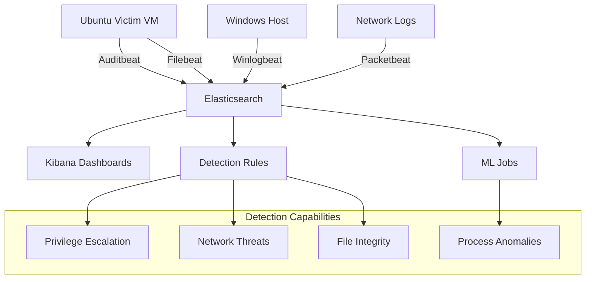

# ⚔️ Detection Engineering Lab – Exports

<p align="center">     </p>

> **Welcome to the Detection Engineering Lab Exports!**  
> This repository contains **Kibana dashboards, index patterns, and detection rules** for monitoring a **Victim Ubuntu VM** where attack simulations and breach testing are performed.

[](https://github.com/your-repo/detection-lab-exports) [](https://github.com/your-repo/detection-lab-exports)

---

## 📑 Table of Contents

- [📂 Folder Structure](https://claude.ai/chat/b7fe4c4c-7853-46d9-93d5-d2215b5f2502#folder-structure)
- [📊 Dashboards](https://claude.ai/chat/b7fe4c4c-7853-46d9-93d5-d2215b5f2502#dashboards)
- [🛡️ Detection Rules](https://claude.ai/chat/b7fe4c4c-7853-46d9-93d5-d2215b5f2502#detection-rules)
- [📥 Import Instructions](https://claude.ai/chat/b7fe4c4c-7853-46d9-93d5-d2215b5f2502#import-instructions)
- [🖥️ Lab Setup](https://claude.ai/chat/b7fe4c4c-7853-46d9-93d5-d2215b5f2502#lab-setup)
- [🚀 Screenshots](https://claude.ai/chat/b7fe4c4c-7853-46d9-93d5-d2215b5f2502#screenshots)
- [⭐ Contribute](https://claude.ai/chat/b7fe4c4c-7853-46d9-93d5-d2215b5f2502#contribute)

---

## Folder Structure

```plaintext
export/
├── detection-rules/
│   ├── privilege_escalation.ndjson
│   └── process_anomaly_detected_ml.ndjson
├── dashboards/
│   ├── victim_ubuntu_vm_dashboard.ndjson
│   └── attack_monitoring_table.ndjson
├── index-patterns/
│   ├── beat-star.ndjson
│   └── auditbeat-filebeat-winlogbeat.ndjson
└── README.md
```

---

## Dashboards

### 1️⃣ **Victim Ubuntu VM Dashboard**

> **Real-time security monitoring for your victim environment**

**Features:**

- ✅ **Real-time process monitoring** via Auditbeat & Filebeat
- ✅ **Top processes & usernames** visualization
- ✅ **Privilege escalation** detection and visualization
- ✅ **Process anomaly trends** (ML-powered detection)
- ✅ **Command execution timeline** for forensic analysis
- ✅ **Network connection monitoring** for lateral movement detection

**Use Cases:**

- SOC monitoring and alerting
- Incident response investigations
- Attack simulation validation
- Threat hunting activities

### 2️⃣ **Attack Monitoring Table**

> **Tabular live view for detailed analysis and triage**

**Features:**

- ✅ **Tabular live view** of all process and user activities
- ✅ **Advanced filtering** for sudo/su usage investigation
- ✅ **Real-time updates** for ongoing attack monitoring
- ✅ **Export capabilities** for incident documentation
- ✅ **Time-based analysis** with customizable ranges

**Use Cases:**

- SOC triage & incident response
- Detailed forensic analysis
- Attack timeline reconstruction
- Evidence collection and documentation

---

## Detection Rules

### 🔴 **1. Privilege Escalation Detection**

> **Detects sudo/su activity and other privilege escalation attempts**

**Technical Details:**

- **Detection Method:** Rule-based monitoring of authentication logs
- **MITRE ATT&CK Mapping:**
    - `T1078` - Valid Accounts
    - `T1068` - Exploitation for Privilege Escalation
    - `T1548.003` - Sudo and Sudo Caching
- **Data Sources:** Auditbeat, system logs, authentication events
- **Severity:** High
- **False Positive Rate:** Low

**Triggers:**

- Successful/failed sudo commands
- Su command usage
- Unusual privilege escalation patterns
- Service account privilege changes

### 🤖 **2. Process Anomaly Detected (ML)**

> **ML-powered rule to detect unusual process behaviors**

**Technical Details:**

- **Detection Method:** Machine Learning anomaly detection
- **MITRE ATT&CK Mapping:**
    - `T1055` - Process Injection
    - `T1036` - Masquerading
    - `T1027` - Obfuscated Files or Information
- **ML Model:** Unsupervised learning on process behavior
- **Severity:** Medium to High (based on anomaly score)
- **Training Period:** 14 days minimum

**Capabilities:**

- Zero-day attack detection
- Lateral movement identification
- Process hollowing detection
- Unusual command line patterns

---

## Import Instructions

### 📋 **Step-by-Step Import Process**

1. **Access Kibana Interface:**
    
    ```
    Navigate to: http://your-kibana-server:5601
    ```
    
2. **Open Import Dialog:**
    
    ```
    Kibana → Stack Management → Saved Objects → Import
    ```
    
3. **Import Order (Important!):**
    
    ```
    1️⃣ index-patterns/ (Import first)
    2️⃣ detection-rules/ (Import second)  
    3️⃣ dashboards/ (Import last)
    ```
    

### ✅ **Verification Steps**

After importing, confirm that:

|Component|Location|Verification|
|---|---|---|
|**Index Patterns**|`Stack Management → Index Patterns`|`*beat-*` pattern exists and shows data|
|**Detection Rules**|`Security → Rules`|Rules appear with "Enabled" status|
|**Dashboards**|`Analytics → Dashboard`|Dashboards load without errors|

### 🔧 **Troubleshooting Import Issues**

<details> <summary><strong>Common Import Problems</strong></summary>

**Index Pattern Conflicts:**

```bash
# Check existing patterns
GET _cat/indices/*beat*

# Verify field mappings
GET auditbeat-*/_mapping
```

**Missing Dependencies:**

- Ensure all beats are sending data to Elasticsearch
- Verify index templates are properly configured
- Check that required fields exist in your data

**Rule Activation Issues:**

- Confirm that the Security app is enabled
- Verify that detection engine is running
- Check rule prerequisites and dependencies

</details>

---

## Lab Setup

### 🖥️ **Infrastructure Requirements**

|Component|Specification|Purpose|
|---|---|---|
|**Victim VM**|Ubuntu 16.04+|Target for attack simulations|
|**ELK Stack**|Elasticsearch 8.8+|Log storage and analysis|
|**Kibana**|Version 8.8+|Visualization and dashboards|
|**Beats Agents**|Latest version|Data collection|

### 📊 **Data Collection Architecture**



### 🔧 **Logging Agents Configuration**

**Required Beats:**

- **Auditbeat:** System audit events and process monitoring
- **Filebeat:** Log file collection and parsing
- **Winlogbeat:** Windows event logs (if applicable)
- **Packetbeat:** Network traffic analysis (optional)

**Destination Options:**

- **Primary:** Elastic Stack 8.8+
- **Secondary:** Splunk (via syslog forwarding)
- **Backup:** Local file storage for redundancy

### 🎯 **Use Case Scenarios**

|Scenario|Tools|Detection Capability|
|---|---|---|
|**Atomic Red Team**|T1078, T1068 tests|Privilege escalation detection|
|**Custom Exploits**|Manual testing|Process anomaly detection|
|**Lateral Movement**|Network pivoting|Connection monitoring|
|**Data Exfiltration**|File access patterns|File integrity monitoring|

---

## Screenshots

### 📊 **Dashboard Previews**

> **Victim Ubuntu VM Dashboard**

![[Pasted image 20250803220911.png]]
![[Pasted image 20250803220951.png]]
![[Pasted image 20250803221007.png]]

> **Attack Monitoring Table**

![[Pasted image 20250803221156.png]]

### 🛡️ **Detection Rule Interface**


![[Pasted image 20250803232324.png]]
![[Pasted image 20250803232351.png]]

### 📈 **ML Job Performance**

![[Pasted image 20250803233836.png]]
![[Pasted image 20250803234451.png]]
![[Pasted image 20250803234546.png]]

---

## Contribute

### 🤝 **How to Contribute**

If you're building your own Detection Lab, we welcome contributions!

**Ways to Contribute:**

- 🔍 **Add new detection rules** for emerging threats
- 📊 **Create custom dashboards** for specific use cases
- 🤖 **Develop ML models** for advanced detection
- 📚 **Improve documentation** and tutorials
- 🐛 **Report bugs** and suggest improvements

### 🚀 **Contribution Guidelines**

1. **Fork this repository**
2. **Create a feature branch:** `git checkout -b feature/new-detection-rule`
3. **Add your changes** with proper documentation
4. **Test thoroughly** in your lab environment
5. **Submit a pull request** with detailed description

### 📋 **Contribution Checklist**

- [ ] Detection rule follows MITRE ATT&CK framework
- [ ] Dashboard includes proper visualizations
- [ ] Documentation updated with new features
- [ ] Screenshots provided for visual components
- [ ] Tested in multiple environments
- [ ] No sensitive information exposed

---

## 🏷️ **Tags & Metadata**

**Technologies:** `Elastic Stack` `Kibana` `Detection Engineering` `SIEM` `SOC`  
**Security Frameworks:** `MITRE ATT&CK` `NIST` `Cyber Kill Chain`  
**Use Cases:** `Incident Response` `Threat Hunting` `Red Team` `Blue Team`

---

## 📄 License

This project is licensed under the MIT License - see the [LICENSE](https://claude.ai/chat/LICENSE) file for details.

---

## 🆘 Support

Need help with your detection lab setup?

- 🐛 **Issues:** Report bugs on our [GitHub Issues](https://claude.ai/chat/issues) page
- 📧 **Contact:** Reach out to the maintainers directly

---

<p align="center">   </p> <p align="center"> <strong>💀 Simulate. Detect. Respond. 💀</strong> </p> <p align="center"> <em>Built with ❤️ for the Cybersecurity Community</em> </p>

---

<div align="center">

**🎯 Happy Hunting! 🔍**

[](https://buymeacoffee.com/your-profile)

</div>