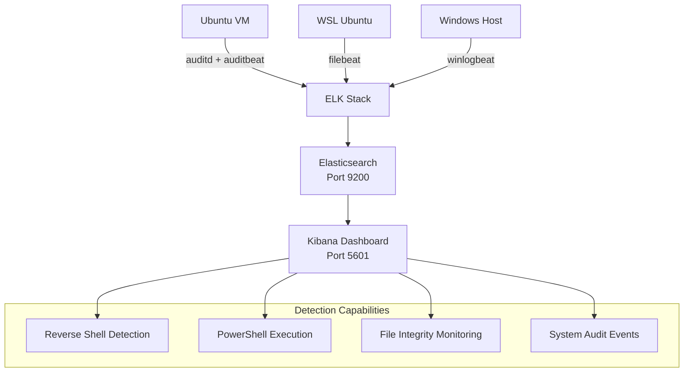

# 📊 Log Collection Setup for AI-Driven Detection Lab

> **Comprehensive log collection configuration for Windows, Ubuntu VM, and WSL Ubuntu machines integrated with ELK stack for advanced threat detection and monitoring.**

[](https://www.elastic.co/) [](https://www.elastic.co/beats/auditbeat) [](https://www.elastic.co/beats/filebeat) [](https://www.elastic.co/beats/winlogbeat)

---

## 📑 Table of Contents

-  [[#📂 Project Structure]]
- [[#🔧 Prerequisites]]
- [[#🐧 Auditbeat Setup (Ubuntu VM)]]
- [[#📄 Filebeat Setup (WSL Ubuntu)]]
- [[#🪟 Winlogbeat Setup (Windows)]]
- [[#💡 Configuration Tips]]
- [[#🧪 Testing & Verification]]
- [[#🔄 Data Flow Architecture]]
- [[#🛠️ Troubleshooting]]
- [[#📈 Performance Optimization]]
- [[#🤝 Contributing]]
- [[#📄 License]]
- [[#🆘 Support]]

---

## 📂 Project Structure

```
log-collection/
│
├── audit.rules          # Linux kernel audit rules for reverse shell & exec detection
├── auditbeat.yml        # Ubuntu VM auditbeat configuration
├── filebeat.yml         # WSL Ubuntu filebeat configuration
└── winlogbeat.yml       # Windows winlogbeat configuration
```

---

## 🔧 Prerequisites

### 🖥️ **Infrastructure Requirements**

|Component|Requirement|
|---|---|
|**ELK Server**|Docker or Manual Installation|
|**Network Ports**|9200 (Elasticsearch), 5601 (Kibana)|
|**Authentication**|Username & Password for elastic user|
|**Memory**|Minimum 4GB RAM for ELK stack|

### 🔒 **Security Components**

- **Sysmon** installed on Windows for detailed logging
- **PowerShell Logging** enabled on Windows systems
- **Audit rules** configured for Linux systems

```powershell
# Enable PowerShell execution policy
Set-ExecutionPolicy RemoteSigned
```

### 📦 **Required Beats Installation**

|System|Beat|Purpose|
|---|---|---|
|**Ubuntu VM**|Auditbeat|System activity & audit events|
|**WSL Ubuntu**|Filebeat|Log file shipping|
|**Windows**|Winlogbeat|Windows Event Logs & Sysmon|

---

## 🐧 Auditbeat Setup (Ubuntu VM)

> **Monitors system activity and audit events for advanced attack detection**

### 📥 Installation

```bash
# Download and install Auditbeat
curl -L -O https://artifacts.elastic.co/downloads/beats/auditbeat/auditbeat-8.x-amd64.deb
sudo dpkg -i auditbeat-8.x-amd64.deb
```

### ⚙️ Configuration

1. **Replace configuration file:**
    
    ```bash
    sudo cp auditbeat.yml /etc/auditbeat/auditbeat.yml
    ```
    
2. **Update connection settings:**
    
    - Replace `<elk-server-ip>` with your ELK server IP
    - Update authentication credentials
    - Ensure **audit.rules** are in `/etc/auditbeat/audit.rules.d/`

### 🔧 Key Configuration Sections

#### **Auditd Module Setup**

```yaml
- module: auditd
  resolve_ids: true
  audit_rules: |
    -a always,exit -F arch=b64 -S execve -F path=/bin/bash -F key=reverse_shell
```

#### **Kibana Dashboard Setup**

```yaml
setup.kibana:
  host: "https://<your-kibana-ip>:5601"
  username: "kibana"
  password: "<your-kibana-password>"
```

#### **Elasticsearch Output**

```yaml
output.elasticsearch:
  hosts: ["https://<your-es-ip>:9200"]
  username: "elastic"
  password: "<your-elastic-password>"
  ssl.verification_mode: none
```

### 🚀 Service Management

```bash
# Start Auditbeat service
sudo systemctl start auditbeat
sudo systemctl status auditbeat
```

### ✅ Verification

```bash
# Test configuration and connectivity
sudo auditbeat test config
sudo auditbeat test output
```

### 📋 Manual Audit Rules (Alternative)

```bash
# Load rules manually
sudo auditctl -D
sudo auditctl -R log-collection/audit.rules

# For persistent boot loading (Ubuntu 16.04/18.04)
sudo cp log-collection/audit.rules /etc/audit/audit.rules
sudo systemctl restart auditd
```

---

## 📄 Filebeat Setup (WSL Ubuntu)

> **Ships log files from Linux systems to ELK for centralized analysis**

### 📥 Installation

```bash
# Download and install Filebeat
curl -L -O https://artifacts.elastic.co/downloads/beats/filebeat/filebeat-8.x-amd64.deb
sudo dpkg -i filebeat-8.x-amd64.deb
```

### ⚙️ Configuration

1. **Replace configuration file:**
    
    ```bash
    sudo cp filebeat.yml /etc/filebeat/filebeat.yml
    ```
    
2. **Update connection settings:**
    
    - Replace `<elk-server-ip>` with your ELK server IP
    - Update authentication credentials

### 🔧 Key Configuration Sections

#### **Log Input Configuration**

```yaml
filebeat.inputs:
- type: log
  enabled: true
  paths:
    - /var/log/*.log
```

#### **Kibana Setup**

```yaml
setup.kibana:
  host: "http://<your-kibana-ip>:5601"
```

#### **Elasticsearch Output**

```yaml
output.elasticsearch:
  hosts: ["https://<your-es-ip>:9200"]
  username: "elastic"
  password: "<your-password>"
  ssl.verification_mode: none
```

#### **Logging Configuration**

```yaml
logging:
  to_files: true
  files:
    path: /var/log/filebeat
```

### 🚀 Service Management

```bash
# Start Filebeat service (WSL Ubuntu)
sudo systemctl start filebeat
sudo systemctl status filebeat
```

### ✅ Verification

```bash
# Test configuration and connectivity
sudo filebeat test config
sudo filebeat test output
```

---

## 🪟 Winlogbeat Setup (Windows)

> **Ships Windows Event Logs, Sysmon logs, and PowerShell logs to ELK**

### 📥 Installation

1. **Download Winlogbeat ZIP** from Elastic's official website
2. **Extract** to `C:\Program Files\Winlogbeat`
3. **Open PowerShell as Administrator**

### ⚙️ Configuration

1. **Replace configuration file:**
    
    ```powershell
    Copy-Item winlogbeat.yml "C:\Program Files\Winlogbeat\winlogbeat.yml"
    ```
    
2. **Update connection settings:**
    
    - Replace `<elk-server-ip>` with your ELK server IP
    - Update authentication credentials

### 📊 **Log Sources Collected:**

- **Security Events**
- **Application Logs**
- **Sysmon Events**
- **PowerShell Execution Logs**

### 🚀 Service Management

```powershell
# Navigate to Winlogbeat directory
cd "C:\Program Files\Winlogbeat"

# Install service first
.\winlogbeat.exe install

# Start the service (Windows)
Start-Service winlogbeat
Get-Service winlogbeat
```

### ✅ Verification

```powershell
# Test configuration and connectivity
.\winlogbeat.exe test config
.\winlogbeat.exe test output
```

---

## 💡 Configuration Tips

### 🔧 **Essential Replacements**

|Placeholder|Replace With|Example|
|---|---|---|
|`<elk-server-ip>`|IP of ELK server|`192.168.1.100`|
|`<elastic-username>`|Usually `elastic`|`elastic`|
|`<elastic-password>`|From ELK setup|`your-secure-password`|

### 🔥 **Firewall Configuration**

```bash
# Ensure required ports are open
sudo ufw allow 9200/tcp  # Elasticsearch
sudo ufw allow 5601/tcp  # Kibana
```

### 🔐 **SSL Configuration**

For self-signed certificates, use:

```yaml
ssl.verification_mode: none
```

---

## 🧪 Testing & Verification

### 🐧 **Ubuntu VM Testing**

```bash
# Test reverse shell detection
/bin/bash -c "echo 'test reverse shell detection'"
```

### 📄 **WSL Ubuntu Testing**

```bash
# Generate test logs
echo "Test log entry $(date)" | sudo tee -a /var/log/test.log
```

### 🪟 **Windows Testing**

```powershell
# Generate PowerShell 4104 events
Write-Host "Testing PowerShell logging" -ForegroundColor Green
```

### 📊 **Kibana Verification**

1. Navigate to **Stack Management → Index Management**
2. Look for indices:
    - `auditbeat-*`
    - `filebeat-*`
    - `winlogbeat-*`

---

## 🔄 Data Flow Architecture



**Data Flow Summary:**

- **Ubuntu VM** → auditd + auditbeat → ELK (Reverse shell detection)
- **WSL Ubuntu** → filebeat (syslog/app logs) → ELK
- **Windows Host** → winlogbeat (Security + PowerShell logs) → ELK

---

## 🛠️ Troubleshooting

<details> <summary><strong>🔍 Common Issues & Solutions</strong></summary>

### **Connection Issues**

```bash
# Test connectivity to Elasticsearch
curl -k -u elastic:password https://elk-server-ip:9200

# Check service status
sudo systemctl status auditbeat  # For VM Ubuntu
sudo systemctl status filebeat   # For WSL Ubuntu

# For Windows (PowerShell)
Get-Service winlogbeat
```

### **Log File Locations**

|System|Log Path|
|---|---|
|**Linux Auditbeat**|`/var/log/auditbeat/auditbeat.log`|
|**Linux Filebeat**|`/var/log/filebeat/filebeat.log`|
|**Windows Winlogbeat**|`C:\ProgramData\winlogbeat\Logs\winlogbeat.log`|

### **Permission Issues**

```bash
# Fix log directory permissions
sudo chown -R root:root /var/log/[beat-name]
sudo chmod -R 755 /var/log/[beat-name]
```

### **Index Template Issues**

```bash
# Reload index templates
sudo [beat-name] setup --index-management
```

</details>

---

## 📈 Performance Optimization

### **Resource Allocation**

|Beat|CPU Usage|Memory Usage|Disk I/O|
|---|---|---|---|
|**Auditbeat**|Low-Medium|~50-100MB|Medium|
|**Filebeat**|Low|~30-50MB|Low-Medium|
|**Winlogbeat**|Medium|~100-200MB|Medium|

### **Configuration Tuning**

```yaml
# Optimize batch processing
output.elasticsearch:
  bulk_max_size: 1000
  flush_interval: 10s
```

---

## 🤝 Contributing

Contributions are welcome! Please feel free to submit a Pull Request for:

- Additional beat configurations
- Enhanced detection rules
- Documentation improvements
- Performance optimizations

---

## 📄 License

This project is licensed under the MIT License - see the [LICENSE](https://claude.ai/chat/LICENSE) file for details.

---

## 🆘 Support

If you encounter issues:

1. Check the [troubleshooting section](https://claude.ai/chat/b7fe4c4c-7853-46d9-93d5-d2215b5f2502#%EF%B8%8F-troubleshooting)
2. Review beat service logs
3. Verify network connectivity
4. Open an issue with detailed logs

---

<div align="center">

**🚀 Happy Log Hunting! 🔍**

[](https://github.com/your-repo/log-collection-setup) [](https://github.com/your-repo/log-collection-setup)

</div>